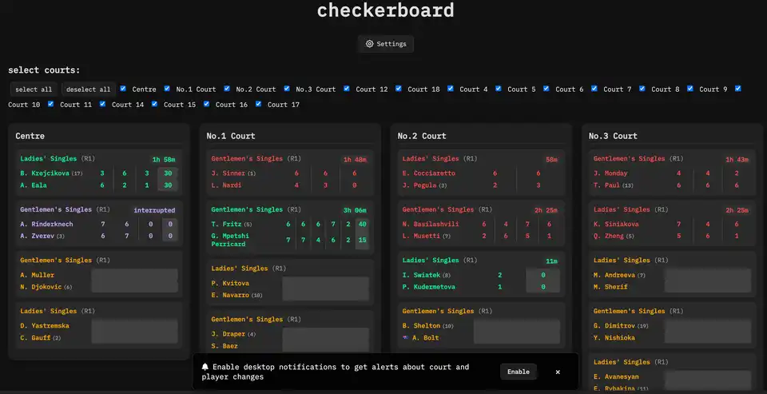

# [Tennis Checkerboard](https://kayleecragg.github.io/tennis/)

## Access the checkerboard at [kayleecragg.github.io/tennis](https://kayleecragg.github.io/tennis/)
## Read blog post about this project at [kayleecragg.github.io/projects/checkerboard](https://kayleecragg.github.io/projects/checkerboard/)

description of files:

- index.html: main page
- offline.html: static page to demonstrate what shows when connection to vercel api goes down
- test.html: test page to test new feature
- schedule.json: static json to use for in between seasons so that vercel isn't getting called

assets folder:
- aaa.gif: for offline page
- checkerboard2.webp: for readme
- rg.png: for future use
- wimbledon.png: for future use

## how it works? 

- msi checkerboard (for roland garros) down since 2024
  - this checkerboard of mine is pretty much only applicable for roland garros since mis' checkerboard not working (rg not paying?)
- roland garros has an api but webpage browser (this github page for example) cannot access because of CORS
- vercel server made so that bypass CORS
- vercel server queries https://www.rolandgarros.com/api/en-us/polling every time it is called by this web page

## result

- court selections (so you only view courts that you want instead of all at once)
- relatively instant updates to scoring
- player change and court change notifications
- pretty colours (yellow for not started, green for ongoing, red for finished, purple for interrupted)
